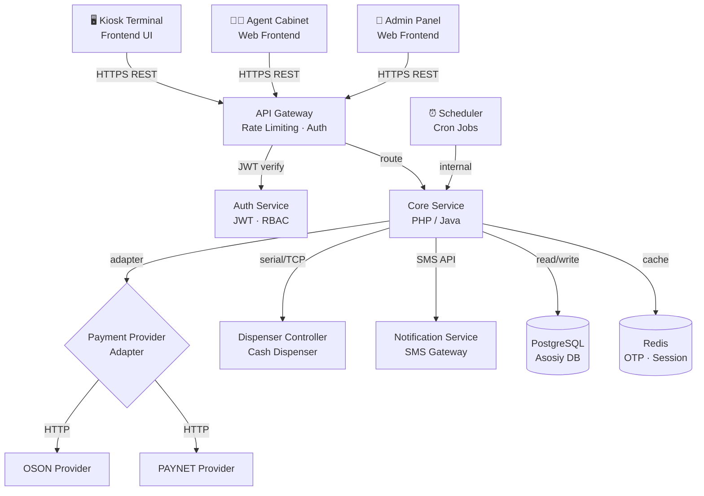
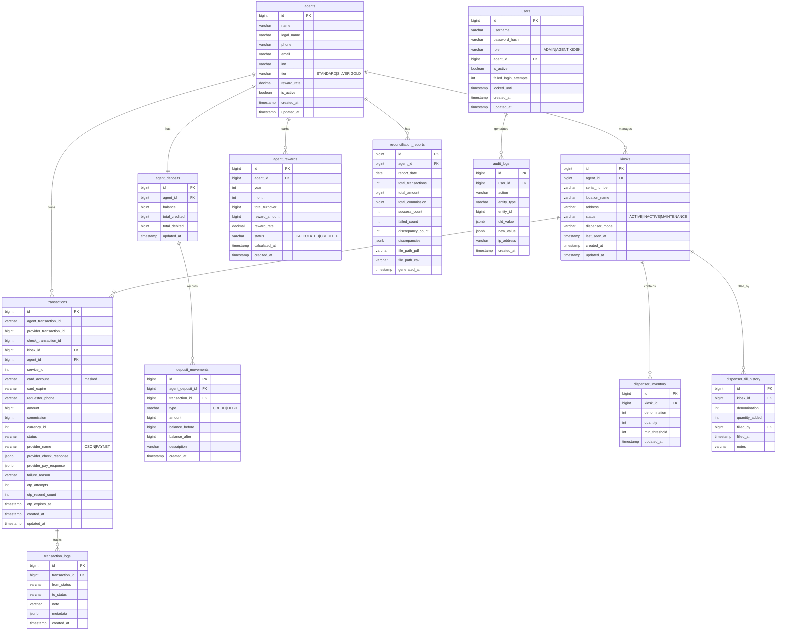
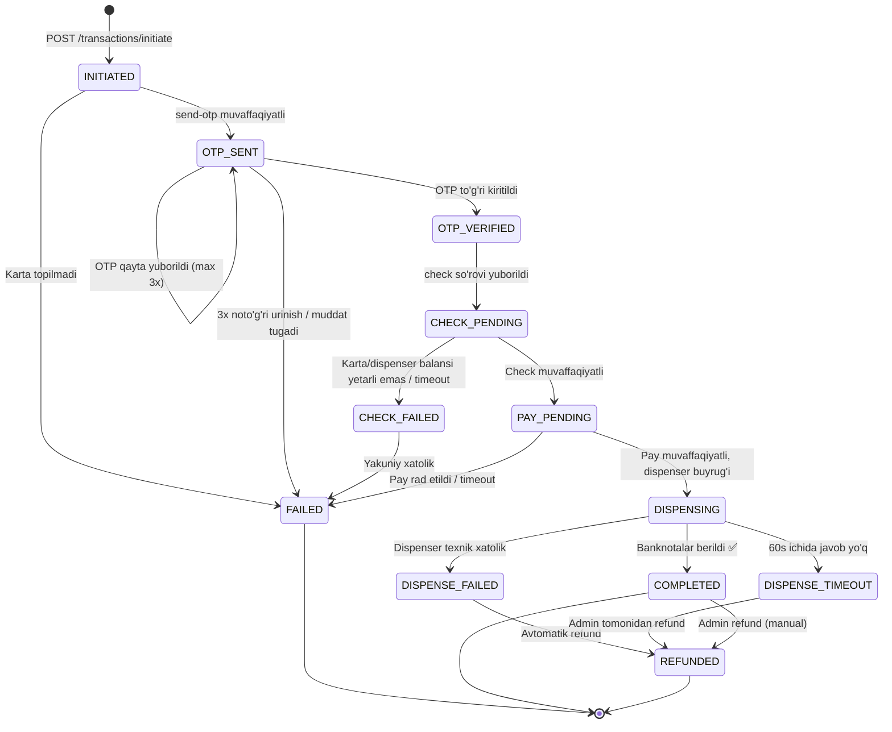
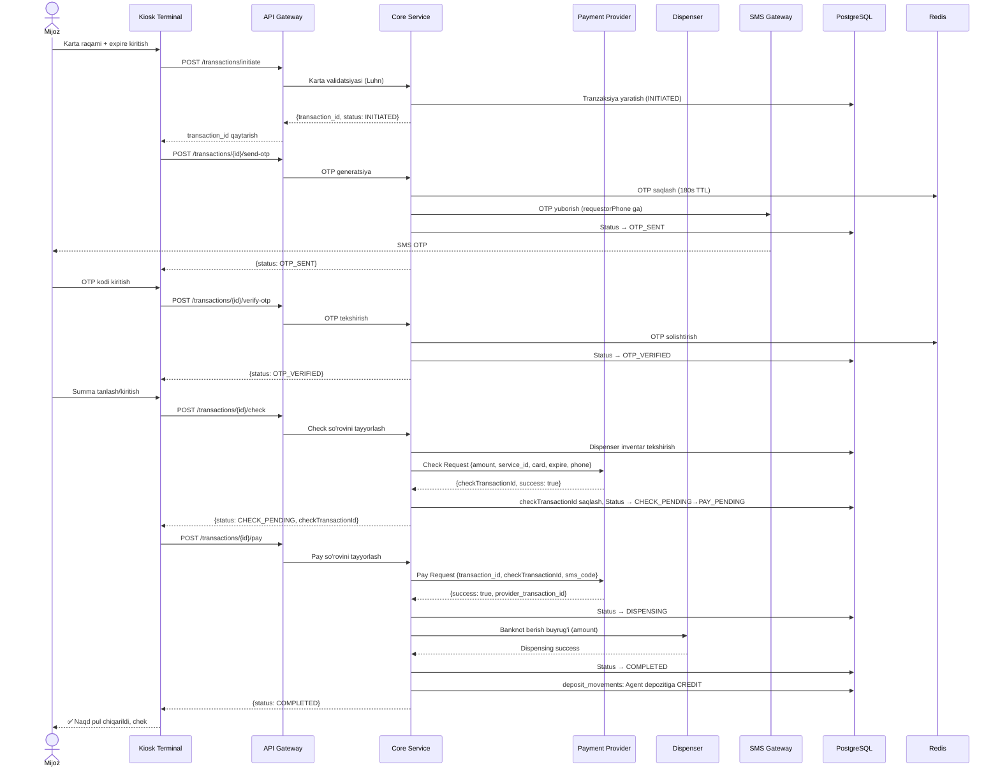
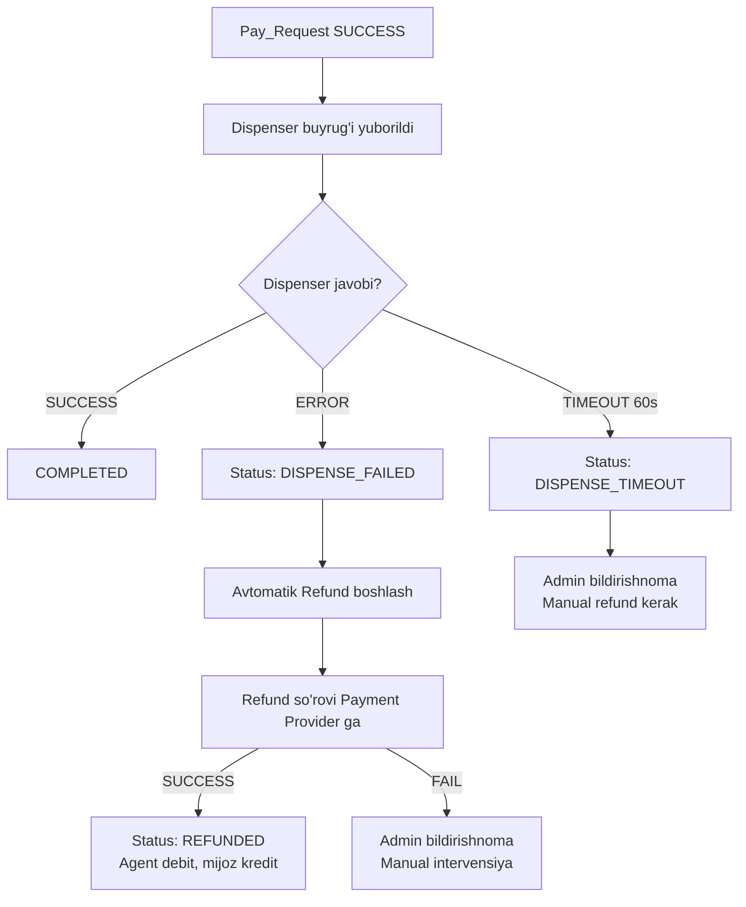

# Texnik Dizayn Hujjati — Kiosk Cash Withdrawal Service

## 1. Tizim Arxitekturasi

### 1.1 Yuqori Darajali Arxitektura (High-Level Architecture)



### 1.2 Komponentlar Tavsifi

| Komponent | Texnologiya | Vazifa |
|-----------|-------------|--------|
| API Gateway | Nginx / Kong | Routing, SSL termination, Rate limiting |
| Core Service | PHP 8.x + Java Spring Boot | Biznes logika, tranzaksiya boshqaruvi |
| Auth Service | JWT (RS256) | Autentifikatsiya, token boshqaruvi |
| Payment Adapter | PHP Interface / Java Interface | OSON/PAYNET provayderga adapter |
| Dispenser Controller | PHP/Java TCP Client | Kiosk dispenser bilan muloqot |
| Notification Service | SMS API (Eskiz / Play Mobile) | OTP va bildirishnomalar yuborish |
| Scheduler | Cron / Spring @Scheduled | Kunlik reconciliation, oylik mukofot |
| PostgreSQL | PostgreSQL 15+ | Asosiy ma'lumotlar bazasi |
| Redis | Redis 7+ | OTP cache, session, rate limiting |

---

## 2. Ma'lumotlar Bazasi Modeli (ERD)



---

## 3. Tranzaksiya Holati Mashina (State Machine)



---

## 4. Asosiy Oqim — Sequence Diagram



---

## 5. REST API Endpointlar

### 5.1 Autentifikatsiya

#### POST /api/v1/auth/login
```json
// Request
{
  "username": "agent001",
  "password": "secret123"
}

// Response 200
{
  "access_token": "eyJhbGciOiJSUzI1NiJ9...",
  "refresh_token": "dGhpcyBpcyBhIHJlZnJlc2g...",
  "expires_in": 3600,
  "role": "AGENT"
}

// Response 401
{
  "error": "INVALID_CREDENTIALS",
  "message": "Login yoki parol noto'g'ri"
}
```

#### POST /api/v1/auth/refresh
```json
// Request
{ "refresh_token": "dGhpcyBpcyBhIHJlZnJlc2g..." }

// Response 200
{ "access_token": "eyJhbGciOiJSUzI1NiJ9...", "expires_in": 3600 }
```

---

### 5.2 Tranzaksiya API (KIOSK roli)

#### POST /api/v1/transactions/initiate
**Tavsif:** Yangi tranzaksiyani boshlash — karta ma'lumotlarini yuborish

```json
// Request
{
  "kiosk_id": 42,
  "card_account": "8600140000005346",
  "card_expire": "12/27",
  "service_id": 8947
}

// Response 200
{
  "transaction_id": 1001,
  "agent_transaction_id": "KSK-1001-20260611",
  "status": "INITIATED",
  "masked_card": "860014******5346"
}

// Response 422
{
  "error": "INVALID_CARD",
  "message": "Karta raqami noto'g'ri formatda"
}
```

#### POST /api/v1/transactions/{id}/send-otp
**Tavsif:** Kartaga ulangan raqamga SMS OTP yuborish

```json
// Request
{ "transaction_id": 1001 }

// Response 200
{
  "status": "OTP_SENT",
  "phone_masked": "998909***900",
  "expires_in": 180
}

// Response 429
{
  "error": "OTP_RESEND_LIMIT",
  "message": "OTP qayta yuborish limiti oshib ketdi"
}
```

#### POST /api/v1/transactions/{id}/verify-otp
**Tavsif:** Mijoz kiritgan OTP ni tasdiqlash

```json
// Request
{ "otp_code": "628952" }

// Response 200
{ "status": "OTP_VERIFIED" }

// Response 400
{
  "error": "INVALID_OTP",
  "message": "OTP kod noto'g'ri",
  "attempts_left": 2
}

// Response 423
{
  "error": "TRANSACTION_BLOCKED",
  "message": "Ko'p urinish: tranzaksiya bekor qilindi",
  "retry_after": 900
}
```

#### POST /api/v1/transactions/{id}/check
**Tavsif:** Dispenser va karta balansi tekshiruvi (Check Request)

```json
// Request
{ "amount": 50000 }

// Response 200
{
  "status": "CHECK_PENDING",
  "check_transaction_id": 1777375741365,
  "available_denominations": [1000, 5000, 10000, 50000, 100000]
}

// Response 422
{
  "error": "INSUFFICIENT_DISPENSER",
  "message": "Kiosk kassasida yetarli naqd pul mavjud emas"
}

// Response 402
{
  "error": "INSUFFICIENT_CARD_BALANCE",
  "message": "Kartada yetarli mablag' mavjud emas"
}
```

#### POST /api/v1/transactions/{id}/pay
**Tavsif:** To'lovni yakunlash va naqd pul berish (Pay Request)

```json
// Request
{
  "sms_code": "628952",
  "check_transaction_id": 1777375741365
}

// Response 200
{
  "status": "COMPLETED",
  "provider_transaction_id": 1777375741365,
  "amount_dispensed": 50000,
  "receipt_number": "RCP-2026-001001"
}

// Response 402
{
  "error": "PAYMENT_DECLINED",
  "message": "To'lov amalga oshmadi, kassirga murojaat qiling"
}

// Response 503
{
  "error": "DISPENSER_ERROR",
  "message": "Dispenser texnik xatoligi yuz berdi",
  "incident_code": "DSP-ERR-001"
}
```

#### GET /api/v1/transactions/{id}/status
**Tavsif:** Tranzaksiya holatini so'rash

```json
// Response 200
{
  "transaction_id": 1001,
  "agent_transaction_id": "KSK-1001-20260611",
  "status": "COMPLETED",
  "amount": 50000,
  "commission": 1500,
  "created_at": "2026-06-11T10:30:00+05:00",
  "updated_at": "2026-06-11T10:31:45+05:00"
}
```

#### GET /api/v1/transactions
**Tavsif:** Tranzaksiyalarni qidirish (agent_transaction_id bo'yicha)

Query params: `?agent_transaction_id=KSK-1001-20260611` yoki `?status=COMPLETED&from=2026-06-01&to=2026-06-11`

---

### 5.3 Refund API (ADMIN roli)

#### POST /api/v1/transactions/{id}/refund
```json
// Request
{
  "reason": "Dispenser banknotlarni bermadi, lekin karta debetlandi",
  "initiated_by": "admin@system.uz"
}

// Response 200
{
  "status": "REFUNDED",
  "refund_amount": 50000,
  "refund_transaction_id": "REF-1001-20260611"
}

// Response 409
{
  "error": "ALREADY_REFUNDED",
  "message": "Ushbu tranzaksiya allaqachon qaytarilgan"
}
```

---

### 5.4 Dispenser API (AGENT/ADMIN roli)

#### POST /api/v1/kiosks/{id}/dispenser/fill
**Tavsif:** Dispenser ga banknot to'ldirish

```json
// Request
{
  "fills": [
    { "denomination": 100000, "quantity": 100 },
    { "denomination": 50000,  "quantity": 200 },
    { "denomination": 10000,  "quantity": 500 }
  ],
  "notes": "Kunlik to'ldirish"
}

// Response 200
{
  "kiosk_id": 42,
  "total_cash_added": 25000000,
  "inventory_after": [
    { "denomination": 100000, "quantity": 100, "total": 10000000 },
    { "denomination": 50000,  "quantity": 200, "total": 10000000 },
    { "denomination": 10000,  "quantity": 500, "total": 5000000 }
  ]
}
```

#### GET /api/v1/kiosks/{id}/dispenser/inventory
```json
// Response 200
{
  "kiosk_id": 42,
  "total_cash": 22750000,
  "last_updated": "2026-06-11T08:00:00+05:00",
  "denominations": [
    { "denomination": 100000, "quantity": 85, "total": 8500000, "status": "OK" },
    { "denomination": 50000,  "quantity": 180, "total": 9000000, "status": "OK" },
    { "denomination": 10000,  "quantity": 525, "total": 5250000, "status": "LOW" }
  ]
}
```

#### GET /api/v1/kiosks/{id}/dispenser/history
Query: `?from=2026-06-01&to=2026-06-11&page=1&per_page=20`

---

### 5.5 Agent API (AGENT roli)

#### GET /api/v1/agents/{id}/deposit/balance
```json
// Response 200
{
  "agent_id": 10,
  "balance": 125000000,
  "total_credited": 890000000,
  "total_debited": 765000000,
  "as_of": "2026-06-11T10:35:00+05:00"
}
```

#### GET /api/v1/agents/{id}/deposit/movements
Query: `?from=2026-06-01&to=2026-06-11&type=CREDIT&page=1&per_page=50`

#### GET /api/v1/agents/{id}/rewards
```json
// Response 200
{
  "agent_id": 10,
  "rewards": [
    {
      "year": 2026, "month": 5,
      "total_turnover": 500000000,
      "reward_rate": 0.005,
      "reward_amount": 2500000,
      "status": "CREDITED",
      "credited_at": "2026-06-01T00:00:00+05:00"
    }
  ]
}
```

#### GET /api/v1/agents/{id}/reconciliation
Query: `?date=2026-06-10`

```json
// Response 200
{
  "agent_id": 10,
  "date": "2026-06-10",
  "total_transactions": 142,
  "success_count": 138,
  "failed_count": 4,
  "total_amount": 7100000,
  "total_commission": 213000,
  "discrepancy_count": 0,
  "download_pdf": "/api/v1/agents/10/reconciliation/download?date=2026-06-10&format=pdf",
  "download_csv": "/api/v1/agents/10/reconciliation/download?date=2026-06-10&format=csv"
}
```

#### GET /api/v1/agents/{id}/report
Query: `?from=2026-06-01&to=2026-06-11&format=xlsx`

---

### 5.6 Admin API (ADMIN roli)

#### GET /api/v1/admin/transactions
Query: `?agent_id=10&kiosk_id=42&status=FAILED&from=2026-06-01&to=2026-06-11&page=1&per_page=100`

#### GET /api/v1/admin/reports/summary
Query: `?period=daily|weekly|monthly&date=2026-06-11`

#### GET /api/v1/admin/kiosks
#### GET /api/v1/admin/agents

---

## 6. Payment Provider Adapter Pattern

### 6.1 Interface Tavsifi

**PHP:**
```php
interface PaymentProviderInterface
{
    public function check(CheckRequest $request): CheckResponse;
    public function pay(PayRequest $request): PayResponse;
    public function refund(RefundRequest $request): RefundResponse;
    public function getStatus(string $transactionId): TransactionStatusResponse;
}
```

**Java:**
```java
public interface PaymentProviderPort {
    CheckResponse check(CheckRequest request);
    PayResponse pay(PayRequest request);
    RefundResponse refund(RefundRequest request);
    TransactionStatusResponse getStatus(String transactionId);
}
```

### 6.2 Adapter Implementatsiyasi

```
PaymentProviderInterface / PaymentProviderPort
        ├── OsonAdapter          (OSON API ga moslashtirilgan)
        └── PaynetAdapter        (PAYNET API ga moslashtirilgan)
```

### 6.3 Konfiguratsiya orqali Almashtirish

`.env` yoki `config.yml` orqali:
```yaml
payment_provider:
  active: oson          # oson | paynet
  oson:
    base_url: https://api.oson.uz/v2
    api_key: ${OSON_API_KEY}
    timeout: 30
  paynet:
    base_url: https://api.paynet.uz/v1
    merchant_id: ${PAYNET_MERCHANT_ID}
    secret_key: ${PAYNET_SECRET_KEY}
    timeout: 30
  sandbox_mode: false
```

### 6.4 DTO Mapping

```
OsonCheckResponse  →  InternalCheckResponse  ←  PaynetCheckResponse
OsonPayResponse    →  InternalPayResponse    ←  PaynetPayResponse
```

---

## 7. Moliyaviy Hisob Modeli

### 7.1 Double-Entry Qoidalari

Har bir tranzaksiya yakunlanganda 2 ta yozuv kiritiladi:

| Operatsiya | Taraf | Summa |
|-----------|-------|-------|
| Mijoz karta → Agent depozit | CREDIT → agent_deposits | `amount - commission` |
| Agent depozit → Komissiya hisobi | DEBIT ← commission_pool | `commission` |

### 7.2 Komissiya Hisoblash Formulasi

```
commission = ROUND(amount × commission_rate / 100, 0)
net_credit  = amount - commission

Misol: amount=50,000, rate=3%
  commission = ROUND(50000 × 3 / 100) = 1,500 so'm
  net_credit = 50,000 - 1,500 = 48,500 so'm
```

### 7.3 Oylik Mukofot Pul Formulasi

```
monthly_turnover = SUM(amount) WHERE status='COMPLETED' 
                   AND agent_id=X 
                   AND month=current_month

reward = ROUND(monthly_turnover × reward_rate, 0)

Misol: turnover=500,000,000, rate=0.5%
  reward = ROUND(500,000,000 × 0.005) = 2,500,000 so'm
```

### 7.4 Rollback Mexanizmi

```
BEGIN TRANSACTION;
  1. Pay_Request muvaffaqiyatli → provider_pay_response saqlash
  2. deposit_movements CREDIT yozuvi → agent_deposits.balance yangilash
  3. dispenser_inventory.quantity kamaytirish
  4. transaction.status = COMPLETED
  IF any step fails → ROLLBACK all changes → status = FAILED
COMMIT;
```

---

## 8. Xatoliklarni Boshqarish

### 8.1 Circuit Breaker Holatlari

```
CLOSED (Normal)
   │ error_rate > 50% AND errors > 5 ichida 60s
   ▼
OPEN (Bloklanган — so'rovlar rad etilади)
   │ 30 soniya o'tdi
   ▼
HALF-OPEN (Sinov so'rovi)
   │ success → CLOSED
   │ failure → OPEN
```

### 8.2 Exponential Backoff Retry

```
Urinish 1: darhol
Urinish 2: 1s kutish
Urinish 3: 2s kutish
Urinish 4: 4s kutish  ← so'nggi (max 3 retry)
Jami: 7s + tarmoq latensiyasi
```

### 8.3 DISPENSE_FAILED Avtomatik Refund Oqimi



### 8.4 Xatolik Kodlari

| Kod | Tavsif | HTTP Status |
|-----|--------|-------------|
| `INVALID_CARD` | Karta raqami noto'g'ri | 422 |
| `CARD_EXPIRED` | Karta muddati o'tgan | 422 |
| `CARD_NOT_FOUND` | Karta topilmadi | 404 |
| `INVALID_OTP` | OTP noto'g'ri | 400 |
| `OTP_EXPIRED` | OTP muddati tugagan | 400 |
| `OTP_BLOCKED` | Ko'p urinish | 423 |
| `INSUFFICIENT_BALANCE` | Kartada mablag' yetarli emas | 402 |
| `INSUFFICIENT_DISPENSER` | Dispenserda naqd yetarli emas | 422 |
| `PAYMENT_DECLINED` | Provayder to'lovni rad etdi | 402 |
| `PROVIDER_TIMEOUT` | Provayder javob bermadi | 504 |
| `DISPENSER_ERROR` | Dispenser xatoligi | 503 |
| `ALREADY_REFUNDED` | Allaqachon qaytarilgan | 409 |
| `TRANSACTION_NOT_FOUND` | Tranzaksiya topilmadi | 404 |

---

## 9. Xavfsizlik Arxitekturasi

### 9.1 JWT Token Tuzilishi (Payload)

```json
{
  "sub": "42",
  "username": "agent001",
  "role": "AGENT",
  "agent_id": 10,
  "iat": 1749600000,
  "exp": 1749603600,
  "jti": "uuid-v4"
}
```

**Algoritem:** RS256 (asimmetrik kalit)
**Access token muddati:** 1 soat
**Refresh token muddati:** 30 kun

### 9.2 RBAC Huquqlar Jadvali

| Endpoint | ADMIN | AGENT | KIOSK |
|----------|-------|-------|-------|
| POST /transactions/initiate | ❌ | ❌ | ✅ |
| POST /transactions/{id}/send-otp | ❌ | ❌ | ✅ |
| POST /transactions/{id}/verify-otp | ❌ | ❌ | ✅ |
| POST /transactions/{id}/check | ❌ | ❌ | ✅ |
| POST /transactions/{id}/pay | ❌ | ❌ | ✅ |
| GET /transactions/{id}/status | ✅ | ✅ | ✅ |
| POST /transactions/{id}/refund | ✅ | ❌ | ❌ |
| POST /kiosks/{id}/dispenser/fill | ✅ | ✅ | ❌ |
| GET /kiosks/{id}/dispenser/inventory | ✅ | ✅ | ❌ |
| GET /agents/{id}/deposit/balance | ✅ | ✅ (o'ziniki) | ❌ |
| GET /agents/{id}/rewards | ✅ | ✅ (o'ziniki) | ❌ |
| GET /agents/{id}/reconciliation | ✅ | ✅ (o'ziniki) | ❌ |
| GET /admin/transactions | ✅ | ❌ | ❌ |
| GET /admin/reports/summary | ✅ | ❌ | ❌ |

### 9.3 Rate Limiting

| Endpoint guruhi | Limit |
|----------------|-------|
| /auth/login | 10 req/daqiqa per IP |
| /transactions/initiate | 5 req/daqiqa per kiosk |
| /transactions/{id}/send-otp | 3 req/15 daqiqa per transaction |
| Umumiy API | 100 req/daqiqa per token |

### 9.4 Karta Ma'lumotlarini Maskelash

```
Saqlash:    8600140000005346  →  DB: 860014******5346
Ko'rsatish: 860014******5346  →  UI: 860014******5346
Log:        860014******5346  →  log files: 860014******5346
```

Karta raqamining to'liq qiymati **hech qachon** DB, log yoki API javobida saqlanmaydi.

---

## 10. Kod Strukturasi

### 10.1 PHP Loyihasi

```
cash-withdrawal-php/
├── app/
│   ├── Http/
│   │   ├── Controllers/
│   │   │   ├── TransactionController.php
│   │   │   ├── DispenserController.php
│   │   │   ├── AgentController.php
│   │   │   ├── AdminController.php
│   │   │   └── AuthController.php
│   │   ├── Middleware/
│   │   │   ├── JwtAuthMiddleware.php
│   │   │   └── RateLimitMiddleware.php
│   │   └── Requests/
│   │       ├── InitiateTransactionRequest.php
│   │       ├── VerifyOtpRequest.php
│   │       └── CheckRequest.php
│   ├── Services/
│   │   ├── TransactionService.php
│   │   ├── OtpService.php
│   │   ├── DispenserService.php
│   │   ├── FinancialService.php
│   │   ├── ReconciliationService.php
│   │   └── RewardService.php
│   ├── Payment/
│   │   ├── Contracts/
│   │   │   └── PaymentProviderInterface.php
│   │   ├── Adapters/
│   │   │   ├── OsonAdapter.php
│   │   │   └── PaynetAdapter.php
│   │   ├── DTO/
│   │   │   ├── CheckRequest.php
│   │   │   ├── CheckResponse.php
│   │   │   ├── PayRequest.php
│   │   │   └── PayResponse.php
│   │   └── PaymentProviderFactory.php
│   ├── Models/
│   │   ├── Transaction.php
│   │   ├── Agent.php
│   │   ├── Kiosk.php
│   │   ├── AgentDeposit.php
│   │   └── DispenserInventory.php
│   ├── Jobs/
│   │   ├── ProcessRefundJob.php
│   │   ├── DailyReconciliationJob.php
│   │   └── MonthlyRewardCalculationJob.php
│   └── Notifications/
│       ├── LowDispenserAlert.php
│       └── DispenseFailedAlert.php
├── database/migrations/
├── routes/api.php
└── config/payment.php
```

### 10.2 Java (Spring Boot) Loyihasi

```
cash-withdrawal-java/
├── src/main/java/uz/cashwithdrawal/
│   ├── api/
│   │   ├── controller/
│   │   │   ├── TransactionController.java
│   │   │   ├── DispenserController.java
│   │   │   ├── AgentController.java
│   │   │   ├── AdminController.java
│   │   │   └── AuthController.java
│   │   ├── dto/
│   │   │   ├── request/
│   │   │   └── response/
│   │   └── filter/
│   │       ├── JwtAuthFilter.java
│   │       └── RateLimitFilter.java
│   ├── domain/
│   │   ├── model/
│   │   │   ├── Transaction.java
│   │   │   ├── Agent.java
│   │   │   ├── Kiosk.java
│   │   │   └── AgentDeposit.java
│   │   ├── repository/
│   │   │   ├── TransactionRepository.java
│   │   │   └── AgentDepositRepository.java
│   │   └── service/
│   │       ├── TransactionService.java
│   │       ├── OtpService.java
│   │       ├── DispenserService.java
│   │       ├── FinancialService.java
│   │       └── RewardService.java
│   ├── payment/
│   │   ├── port/
│   │   │   └── PaymentProviderPort.java
│   │   ├── adapter/
│   │   │   ├── OsonAdapter.java
│   │   │   └── PaynetAdapter.java
│   │   └── dto/
│   │       ├── CheckRequest.java
│   │       ├── CheckResponse.java
│   │       ├── PayRequest.java
│   │       └── PayResponse.java
│   ├── scheduler/
│   │   ├── DailyReconciliationScheduler.java
│   │   └── MonthlyRewardScheduler.java
│   └── config/
│       ├── SecurityConfig.java
│       ├── PaymentProviderConfig.java
│       └── CircuitBreakerConfig.java
└── src/main/resources/
    ├── application.yml
    └── db/migration/
```

---

## 11. Joylashtirish (Deployment) Arxitekturasi

```
Internet
    │
    ▼
[Load Balancer / Nginx]
    │
    ├── [API Service — PHP/Java] × 2 (HA)
    │        │
    │        ├── [PostgreSQL Primary]
    │        │        └── [PostgreSQL Replica] (read)
    │        │
    │        └── [Redis Cluster] (OTP, sessions)
    │
    ├── [Admin Panel — Static] (Nginx)
    │
    └── [Agent Cabinet — Static] (Nginx)

Kiosk Terminals (VPN/Private Network)
    └── → API Gateway → API Service
```

### Muhit o'zgaruvchilari (Environment Variables)

```env
APP_ENV=production
DB_HOST=postgres-primary
DB_NAME=cashwithdrawal
DB_USER=cwuser
DB_PASS=strong_password

REDIS_HOST=redis-cluster
REDIS_PORT=6379

JWT_PRIVATE_KEY_PATH=/secrets/jwt_private.pem
JWT_PUBLIC_KEY_PATH=/secrets/jwt_public.pem

PAYMENT_PROVIDER=oson
OSON_API_KEY=***
OSON_BASE_URL=https://api.oson.uz/v2

SMS_GATEWAY_URL=https://notify.eskiz.uz/api
SMS_GATEWAY_TOKEN=***

DISPENSER_TCP_HOST=127.0.0.1
DISPENSER_TCP_PORT=9000
DISPENSER_TIMEOUT=60
```
