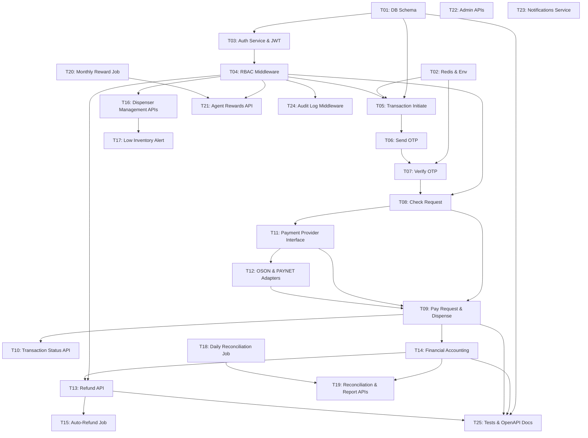

# Vazifalar Ro'yxati — Kiosk Cash Withdrawal Service

## Vazifalar Bog'liqligi Grafigi (Task Dependency Graph)



---

## FAZA 1 — Infratuzilma va Ma'lumotlar Bazasi

### T01 — Ma'lumotlar Bazasi Sxemasini Yaratish

**Tavsif:** PostgreSQL da barcha jadvallarni migration orqali yaratish.

**Yaratilishi kerak bo'lgan jadvallar:**
- `users` (id, username, password_hash, role, agent_id, is_active, failed_login_attempts, locked_until, created_at, updated_at)
- `agents` (id, name, legal_name, phone, email, inn, tier, reward_rate, is_active, created_at, updated_at)
- `kiosks` (id, agent_id FK, serial_number, location_name, address, status, dispenser_model, last_seen_at, created_at, updated_at)
- `transactions` (id, agent_transaction_id, provider_transaction_id, check_transaction_id, kiosk_id FK, agent_id FK, service_id, card_account, card_expire, requestor_phone, amount BIGINT, commission BIGINT, currency_id, status, provider_name, provider_check_response JSONB, provider_pay_response JSONB, failure_reason, otp_attempts, otp_resend_count, otp_expires_at, created_at, updated_at)
- `transaction_logs` (id, transaction_id FK, from_status, to_status, note, metadata JSONB, created_at)
- `agent_deposits` (id, agent_id FK UNIQUE, balance BIGINT, total_credited BIGINT, total_debited BIGINT, updated_at)
- `deposit_movements` (id, agent_deposit_id FK, transaction_id FK, type, amount BIGINT, balance_before BIGINT, balance_after BIGINT, description, created_at)
- `dispenser_inventory` (id, kiosk_id FK, denomination INT, quantity INT, min_threshold INT DEFAULT 20, updated_at)
- `dispenser_fill_history` (id, kiosk_id FK, denomination, quantity_added, filled_by FK, filled_at, notes)
- `agent_rewards` (id, agent_id FK, year, month, total_turnover BIGINT, reward_amount BIGINT, reward_rate DECIMAL, status, calculated_at, credited_at)
- `reconciliation_reports` (id, agent_id FK, report_date DATE, total_transactions, total_amount BIGINT, total_commission BIGINT, success_count, failed_count, discrepancy_count, discrepancies JSONB, file_path_pdf, file_path_csv, generated_at)
- `audit_logs` (id, user_id FK, action, entity_type, entity_id, old_value JSONB, new_value JSONB, ip_address, created_at)

**Indekslar:**
- `transactions.agent_transaction_id` (UNIQUE)
- `transactions.status, created_at` (composite)
- `transactions.kiosk_id, agent_id`
- `deposit_movements.agent_deposit_id, created_at`
- `audit_logs.user_id, created_at`

**Bog'liqliklar:** Yo'q (birinchi vazifa)

**Qanoatlantirilgan talablar:** Talab 6, 7, 8, 9, 10, 13

---

### T02 — Redis, Environment Konfiguratsiyasi va Loyiha Asosi

**Tavsif:** Redis ulanishini sozlash, `.env` / `application.yml` konfiguratsiya fayllarini yaratish, loyiha asosiy strukturasini tayyorlash.

**Bajarilishi kerak:**
- Redis 7+ ulanish konfiguratsiyasi (OTP cache, session, rate limiting uchun)
- PHP: `config/payment.php`, `config/redis.php`, `.env.example`
- Java: `application.yml` barcha muhit o'zgaruvchilari bilan
- JWT RS256 kalit juftini generatsiya qilish (`jwt_private.pem`, `jwt_public.pem`)
- Loyiha papka strukturasini yaratish (design.md 10-bo'lim bo'yicha)
- Rate limiting konfiguratsiyasi (Nginx yoki Kong)

**Bog'liqliklar:** Yo'q (T01 bilan parallel bajariladi)

**Qanoatlantirilgan talablar:** Talab 13, 14

---

## FAZA 2 — Autentifikatsiya va Avtorizatsiya

### T03 — Auth Service: Login va JWT Token Chiqarish

**Tavsif:** Foydalanuvchi login endpointini va JWT token boshqaruvini implementatsiya qilish.

**Bajarilishi kerak:**
- `POST /api/v1/auth/login` endpointi
  - username/password tekshirish (bcrypt)
  - 5 marta noto'g'ri urinishda 30 daqiqa blok
  - Muvaffaqiyatli kirishda RS256 JWT access token (1 soat) va refresh token (30 kun) chiqarish
  - JWT payload: `{sub, username, role, agent_id, iat, exp, jti}`
- `POST /api/v1/auth/refresh` endpointi
  - Refresh token validatsiyasi va yangi access token chiqarish
- `POST /api/v1/auth/logout`
  - Refresh tokenni bekor qilish (Redis blacklist)

**Bog'liqliklar:** T01, T02

**Qanoatlantirilgan talablar:** Talab 13 (AC 1, 4, 5, 6)

---

### T04 — RBAC Middleware va Audit Log

**Tavsif:** Barcha himoyalangan endpointlar uchun JWT tekshiruvi va rol asosidagi kirish nazoratini implementatsiya qilish.

**Bajarilishi kerak:**
- JWT auth middleware/filter — barcha `/api/v1/` endpointlariga qo'llash
- RBAC enforcement — design.md 9.2-jadval bo'yicha:
  - `KIOSK` roli → faqat tranzaksiya endpointlari
  - `AGENT` roli → o'z ma'lumotlari (agent_id tekshiruvi)
  - `ADMIN` roli → barcha endpointlar
- Audit log middleware — har bir so'rovda `audit_logs` jadvaliga yozish (action, entity, ip_address)
- Unauthorized (401) va Forbidden (403) javoblarini standartlashtirish

**Bog'liqliklar:** T01, T03

**Qanoatlantirilgan talablar:** Talab 13 (AC 2, 3, 7)

---

## FAZA 3 — Tranzaksiya Asosiy Oqimi

### T05 — Tranzaksiya Boshlash (Initiate)

**Tavsif:** Yangi tranzaksiyani boshlash va karta ma'lumotlarini validatsiya qilish.

**Bajarilishi kerak:**
- `POST /api/v1/transactions/initiate` endpointi (KIOSK roli)
- Karta raqami validatsiyasi:
  - 16 ta raqam formati tekshiruvi
  - Luhn algoritmi tekshiruvi
  - Karta amal qilish muddati `MM/YY` formati va o'tmishdagilik tekshiruvi
- Karta raqamini maskelash: `860014******5346` (6 ta ochiq + 6 ta yashirin + 4 ta ochiq)
- `transactions` jadvalida yangi yozuv yaratish (status: `INITIATED`)
- `transaction_logs` ga dastlabki holat yozuvi
- Unique `agent_transaction_id` generatsiya qilish
- Response: `{transaction_id, agent_transaction_id, status, masked_card}`

**Xatolik holatlari:**
- `INVALID_CARD` (422) — Luhn tekshiruvi o'tmagan
- `CARD_EXPIRED` (422) — muddati o'tgan

**Bog'liqliklar:** T01, T02, T04

**Qanoatlantirilgan talablar:** Talab 1 (barcha AC)

---

### T06 — SMS OTP Yuborish

**Tavsif:** Kartaga ulangan telefon raqamiga bir martalik SMS parol yuborish.

**Bajarilishi kerak:**
- `POST /api/v1/transactions/{id}/send-otp` endpointi (KIOSK roli)
- Tranzaksiya `INITIATED` holatda ekanligini tekshirish
- 6 ta raqamdan iborat tasodifiy OTP generatsiya qilish
- OTP ni Redis da saqlash: key=`otp:{transaction_id}`, value=`{code, attempts:0}`, TTL=180s
- SMS gateway (Eskiz / Play Mobile) orqali `requestorPhone` ga OTP yuborish
- Tranzaksiya holatini `OTP_SENT` ga yangilash, `otp_expires_at` ni belgilash
- OTP qayta yuborish limiti: bir tranzaksiya uchun max 3 marta (`otp_resend_count`)
- Telefon raqamini maskelash javobda: `998909***900`

**Xatolik holatlari:**
- `OTP_RESEND_LIMIT` (429) — 3 martadan ortiq so'rov
- `SMS_ERROR` (503) — SMS gateway xatoligi

**Bog'liqliklar:** T05

**Qanoatlantirilgan talablar:** Talab 2 (AC 1, 2, 7, 8)

---

### T07 — OTP Tasdiqlash

**Tavsif:** Mijoz kiritgan OTP kodni Redis dan tekshirish.

**Bajarilishi kerak:**
- `POST /api/v1/transactions/{id}/verify-otp` endpointi (KIOSK roli)
- Redis dan OTP kodni olish va solishtirish
- Noto'g'ri urinish hisoblagichi (`otp_attempts`):
  - Har noto'g'ri urinishda `attempts` ni oshirish
  - 3 marta noto'g'ri → tranzaksiyani `FAILED` ga o'tkazish, 15 daqiqa yangi urinishni bloklash
- OTP muddati tugaganligini tekshirish (Redis TTL)
- To'g'ri OTP kiritilganda → holatni `OTP_VERIFIED` ga yangilash, Redis dan OTP o'chirish

**Xatolik holatlari:**
- `INVALID_OTP` (400) — noto'g'ri kod, `attempts_left` qaytarish
- `OTP_EXPIRED` (400) — muddat tugagan
- `TRANSACTION_BLOCKED` (423) — 3x noto'g'ri, `retry_after: 900` qaytarish

**Bog'liqliklar:** T06

**Qanoatlantirilgan talablar:** Talab 2 (AC 3, 4, 5, 6)

---

### T08 — Check Request: Dispenser va Karta Balansi Tekshiruvi

**Tavsif:** Payment Provider ga Check Request yuborish va dispenser inventarini tekshirish.

**Bajarilishi kerak:**
- `POST /api/v1/transactions/{id}/check` endpointi (KIOSK roli)
- Tranzaksiya `OTP_VERIFIED` holatda ekanligini tekshirish
- Summa validatsiyasi:
  - Minimal: 10,000 so'm
  - Maksimal: 5,000,000 so'm
  - 1,000 so'm karrali bo'lishi shart
- Dispenser inventar tekshiruvi: `dispenser_inventory` jadvalidan so'ralgan summani berish uchun yetarli banknotlar bor-yo'qligini hisoblash
- Tranzaksiyani `CHECK_PENDING` holatiga yangilash
- Payment Provider ga Check Request yuborish (T11 adapter orqali):
  ```json
  {"amount": N, "service_id": 8947, "agent_transaction_id": "...", "params": {"card_expire": "MM/YY", "requestorPhone": "998..."}, "account": "860014******5346"}
  ```
- Muvaffaqiyatli javob: `checkTransactionId` ni saqlash, holat → `PAY_PENDING`
- Muvaffaqiyatsiz: holat → `CHECK_FAILED` → `FAILED`

**Xatolik holatlari:**
- `INSUFFICIENT_DISPENSER` (422)
- `INSUFFICIENT_CARD_BALANCE` (402)
- `AMOUNT_INVALID` (422) — karrali emas / chegaradan tashqari
- `PROVIDER_TIMEOUT` (504) — 30s timeout

**Bog'liqliklar:** T07, T11, T04

**Qanoatlantirilgan talablar:** Talab 3, 4 (barcha AC)

---

### T09 — Pay Request: To'lovni Yakunlash va Naqd Pul Berish

**Tavsif:** Payment Provider ga Pay Request yuborib, dispenser dan naqd pul berish.

**Bajarilishi kerak:**
- `POST /api/v1/transactions/{id}/pay` endpointi (KIOSK roli)
- Tranzaksiya `PAY_PENDING` holatda ekanligini tekshirish
- Payment Provider ga Pay Request yuborish (T11 adapter orqali):
  ```json
  {"transaction_id": N, "currencyId": 0, "checkTransactionId": N, "params": {"sms_code": "..."}}
  ```
- Muvaffaqiyatli javob → holatni `DISPENSING` ga yangilash
- Dispenser TCP client ga banknot berish buyrug'i yuborish (60s timeout)
- Dispenser muvaffaqiyatli → holatni `COMPLETED` ga yangilash, T14 moliyaviy hisob chaqirish
- Dispenser xatoligi → `DISPENSE_FAILED`, T15 auto-refund jobni trigger qilish
- Dispenser 60s timeout → `DISPENSE_TIMEOUT`, admin ogohlantirish

**Xatolik holatlari:**
- `PAYMENT_DECLINED` (402)
- `PROVIDER_TIMEOUT` (504)
- `DISPENSER_ERROR` (503) — `incident_code` bilan

**Bog'liqliklar:** T08, T11, T12, T14

**Qanoatlantirilgan talablar:** Talab 5 (barcha AC)

---

### T10 — Tranzaksiya Holati va Qidiruv API

**Tavsif:** Tranzaksiya holatini so'rash va qidiruv endpointlarini implementatsiya qilish.

**Bajarilishi kerak:**
- `GET /api/v1/transactions/{id}/status` — barcha rollar (o'z tranzaksiyalari)
- `GET /api/v1/transactions` — qidiruv:
  - `?agent_transaction_id=...`
  - `?status=COMPLETED&from=2026-06-01&to=2026-06-11`
  - `?kiosk_id=42&page=1&per_page=50`
- 5 daqiqadan ortiq `UNKNOWN` / `PAY_PENDING` holatdagi tranzaksiyalar uchun admin ogohlantirish

**Bog'liqliklar:** T01, T04

**Qanoatlantirilgan talablar:** Talab 6 (barcha AC)

---

## FAZA 4 — Payment Provider Integratsiyasi

### T11 — Payment Provider Interface va Factory

**Tavsif:** Adapter pattern arxitekturasini yaratish.

**Bajarilishi kerak:**

**PHP:**
```php
interface PaymentProviderInterface {
    public function check(CheckRequest $request): CheckResponse;
    public function pay(PayRequest $request): PayResponse;
    public function refund(RefundRequest $request): RefundResponse;
    public function getStatus(string $transactionId): TransactionStatusResponse;
}
```

**Java:**
```java
public interface PaymentProviderPort {
    CheckResponse check(CheckRequest request);
    PayResponse pay(PayRequest request);
    RefundResponse refund(RefundRequest request);
    TransactionStatusResponse getStatus(String transactionId);
}
```

- DTO klasslar: `CheckRequest`, `CheckResponse`, `PayRequest`, `PayResponse`, `RefundRequest`, `RefundResponse`
- `PaymentProviderFactory` — `PAYMENT_PROVIDER=oson|paynet` konfiguratsiyasidan adapter tanlash
- Internal Response DTO mapping qatlami
- Sandbox/test mode: haqiqiy tranzaksiya bajarmasdan test

**Bog'liqliklar:** T02

**Qanoatlantirilgan talablar:** Talab 14 (barcha AC)

---

### T12 — OSON va PAYNET Adapter Implementatsiyasi

**Tavsif:** Ikkita payment provider uchun adapter klasslarini yozish.

**Bajarilishi kerak:**
- `OsonAdapter` — OSON API (`https://api.oson.uz/v2`) ga HTTP so'rovlar
- `PaynetAdapter` — PAYNET API (`https://api.paynet.uz/v1`) ga HTTP so'rovlar
- Har ikki adapter uchun:
  - HTTP client (timeout: 30s)
  - Request/Response marshaling (OSON/PAYNET formatidan InternalDTO ga)
  - Har bir Check/Pay so'rovi logga yozilishi (request va response to'liq)
  - **Exponential Backoff Retry** (tarmoq xatoligida): 1s → 2s → 4s (3 urinish)
  - **Circuit Breaker**: CLOSED → OPEN (error_rate > 50% in 60s, min 5 xatolik) → HALF-OPEN (30s) → CLOSED/OPEN

**Bog'liqliklar:** T11

**Qanoatlantirilgan talablar:** Talab 14 (AC 2, 3, 4), Talab 15 (AC 4)

---

## FAZA 5 — Dispenser Kontroller

### T13 — Dispenser TCP/Serial Client

**Tavsif:** Kiosk dispenser qurilmasi bilan muloqot qiluvchi komponentni implementatsiya qilish.

**Bajarilishi kerak:**
- TCP/Serial client (`DISPENSER_TCP_HOST`, `DISPENSER_TCP_PORT`)
- Banknot berish buyrug'i: so'm summasi → denomination bo'yicha parslash va dispenser protokoli formatida yuborish
- Dispenser javobini 60s kutish
- Muvaffaqiyatli javob → `dispenser_inventory.quantity` kamaytirish (atomik DB operatsiya)
- `DISPENSE_FAILED` holati:
  - Tranzaksiyani `DISPENSE_FAILED` ga yangilash
  - Auto-refund jobni trigger qilish (T15)
  - Admin + agent ga SMS va tizim bildirishnomasi (T23)
- `DISPENSE_TIMEOUT` holati:
  - Tranzaksiyani `DISPENSE_TIMEOUT` ga yangilash
  - Admin ogohlantirish

**Bog'liqliklar:** T01, T04

**Qanoatlantirilgan talablar:** Talab 5 (AC 3, 7), Talab 15 (AC 1, 2, 5)

---

## FAZA 6 — Moliyaviy Hisob

### T14 — Double-Entry Moliyaviy Hisob

**Tavsif:** Tranzaksiya yakunlanganda agent depozitiga kirim va komissiya hisoblash.

**Bajarilishi kerak:**
- Tranzaksiya `COMPLETED` bo'lganda DB transaction ichida:
  1. Komissiya hisoblash: `commission = ROUND(amount × commission_rate / 100, 0)`
  2. `deposit_movements` ga CREDIT yozuvi: `net_credit = amount - commission`
  3. `agent_deposits.balance` ni yangilash: `balance += net_credit`
  4. `agent_deposits.total_credited` ni yangilash
  5. Komissiya pool jadvaliga yozuv
  6. `transaction.commission` maydoni yangilanishi
- Xatolik holati → to'liq ROLLBACK, holat `FAILED`
- `GET /api/v1/agents/{id}/deposit/balance` endpointi
- `GET /api/v1/agents/{id}/deposit/movements` endpointi (filtrlash: type, date range, pagination)

**Bog'liqliklar:** T09, T01, T04

**Qanoatlantirilgan talablar:** Talab 7 (barcha AC)

---

## FAZA 7 — Qaytarish (Refund)

### T15 — Refund API va Auto-Refund Job

**Tavsif:** Manual va avtomatik refund mexanizmini implementatsiya qilish.

**Bajarilishi kerak:**

**Manual Refund (ADMIN roli):**
- `POST /api/v1/transactions/{id}/refund`
- Validatsiyalar:
  - Tranzaksiya `COMPLETED` holatda bo'lishi shart
  - Allaqachon `REFUNDED` bo'lmagan bo'lishi shart (409 `ALREADY_REFUNDED`)
  - Faqat `ADMIN` roli
- Payment Provider ga refund so'rovi yuborish
- Muvaffaqiyatli: `deposit_movements` ga DEBIT yozuvi (agent depozitidan yechish), holat → `REFUNDED`
- `refund_transaction_id` generatsiya va log yozuvi

**Auto-Refund Job (`DISPENSE_FAILED` uchun):**
- Background job: Payment Provider ga refund so'rovi
- Muvaffaqiyatli → `REFUNDED`, agent debit, bildirishnoma
- Muvaffaqiyatsiz → admin ogohlantirish, manual intervensiya zarur

**Tizim qayta ishga tushganda recovery:**
- `PAY_PENDING` va `DISPENSING` holatdagi tranzaksiyalarni aniqlash
- Payment Provider dan haqiqiy holat so'rash
- Holat bo'yicha: COMPLETED → T14 chaqirish; FAILED → FAILED ga o'tkazish

**Bog'liqliklar:** T14, T13, T11

**Qanoatlantirilgan talablar:** Talab 11 (barcha AC), Talab 15 (AC 1, 2, 3)

---

## FAZA 8 — Dispenser Boshqaruvi

### T16 — Dispenser To'ldirish va Inventar API

**Tavsif:** Kiosk dispenser banknot inventarini boshqarish endpointlarini implementatsiya qilish.

**Bajarilishi kerak:**
- `POST /api/v1/kiosks/{id}/dispenser/fill` (AGENT/ADMIN roli)
  - Request: `{fills: [{denomination: 100000, quantity: 100}, ...], notes: "..."}`
  - `dispenser_inventory` jadvalidagi denomination uchun `quantity` ni oshirish
  - `dispenser_fill_history` ga yozuv kiritish
  - Jami qo'shilgan summa hisoblash va qaytarish
- `GET /api/v1/kiosks/{id}/dispenser/inventory` — real-time inventar
  - Har bir denomination uchun: quantity, total, status (`OK`/`LOW`/`EMPTY`)
- `GET /api/v1/kiosks/{id}/dispenser/history` — to'ldirish tarixi (filtrlash, pagination)

**Bog'liqliklar:** T01, T04

**Qanoatlantirilgan talablar:** Talab 10 (AC 1, 2, 5, 6)

---

### T17 — Kam Inventar Ogohlantirishi

**Tavsif:** Dispenser banknotlari belgilangan minimal chegaradan (20 ta) tushib ketganda ogohlantirish.

**Bajarilishi kerak:**
- Har bir tranzaksiya `COMPLETED` bo'lgandan so'ng va to'ldirish operatsiyasidan so'ng inventar tekshiruvi
- `dispenser_inventory.quantity < min_threshold (default: 20)` bo'lsa:
  - Agent va admin ga SMS ogohlantirish (T23 orqali)
  - Tizim ichki bildirishnoma
  - Qaysi denomination va qancha qolganligini ko'rsatish
- `EMPTY` holat: quantity = 0 → kiosk statusini `MAINTENANCE` ga o'tkazish

**Bog'liqliklar:** T16, T23

**Qanoatlantirilgan talablar:** Talab 10 (AC 4)

---

## FAZA 9 — Hisobot va Reconciliation

### T18 — Kunlik Reconciliation Job

**Tavsif:** Har kechasi 23:59 da agent uchun kunlik solishtirma dalolatnoma avtomatik yaratish.

**Bajarilishi kerak:**
- Cron job / Spring `@Scheduled`: har kuni 23:59 (UTC+5)
- Har bir aktiv agent uchun:
  - Kun davomidagi barcha tranzaksiyalarni yig'ish
  - Hisoblash: `total_transactions, total_amount, total_commission, success_count, failed_count`
  - Payment Provider dan shu kun uchun dalolatnoma so'rash
  - Tizim va provider ma'lumotlarini solishtirish → mos kelmaydigan tranzaksiyalar → `discrepancies` JSONB
- `reconciliation_reports` jadvalida yangi yozuv yaratish
- PDF va CSV fayllarini generatsiya qilib `file_path_pdf`, `file_path_csv` saqlash

**Bog'liqliklar:** T14, T11

**Qanoatlantirilgan talablar:** Talab 8 (AC 1, 2, 3, 4)

---

### T19 — Reconciliation va Hisobot API

**Tavsif:** Agent va admin uchun hisobot endpointlarini implementatsiya qilish.

**Bajarilishi kerak:**
- `GET /api/v1/agents/{id}/reconciliation?date=YYYY-MM-DD` — kunlik dalolatnoma
  - PDF va CSV yuklab olish havolalari bilan
- `GET /api/v1/agents/{id}/reconciliation/download?date=...&format=pdf|csv` — fayl yuklab olish
- `GET /api/v1/agents/{id}/report?from=...&to=...&format=xlsx|csv` — ixtiyoriy sana oralig'i hisoboti
  - > 10,000 yozuv bo'lsa: fon rejimida generatsiya, tayyor bo'lganda yuklab olish havolasi
- `GET /api/v1/admin/reports/summary?period=daily|weekly|monthly&date=...`
  - Kiosk bo'yicha statistika, agent bo'yicha statistika, muvaffaqiyatsiz tranzaksiyalar nisbati

**Bog'liqliklar:** T18, T14, T04

**Qanoatlantirilgan talablar:** Talab 8 (AC 5), Talab 12 (barcha AC)

---

## FAZA 10 — Agent Mukofot Puli

### T20 — Oylik Mukofot Pul Hisoblash Job

**Tavsif:** Oy oxirida agent mukofot pulini avtomatik hisoblash va depozitga kirim qilish.

**Bajarilishi kerak:**
- Cron job / Spring `@Scheduled`: har oyning oxirgi kuni 23:59 (UTC+5)
- Har bir aktiv agent uchun:
  - `monthly_turnover = SUM(amount) WHERE status='COMPLETED' AND agent_id=X AND month=current`
  - `reward = ROUND(monthly_turnover × reward_rate, 0)` — agent `tier` bo'yicha belgilangan `reward_rate`
  - `deposit_movements` ga CREDIT yozuvi (reward_amount)
  - `agent_deposits.balance` yangilash
  - `agent_rewards` jadvalida yangi yozuv (`CALCULATED` → `CREDITED`)
  - Agentga bildirishnoma (T23 orqali): SMS + tizim xabari

**Bog'liqliklar:** T14, T23

**Qanoatlantirilgan talablar:** Talab 9 (barcha AC)

---

### T21 — Agent Mukofot API

**Tavsif:** Agent mukofot tarixi va joriy oy taxminini ko'rsatuvchi endpointlar.

**Bajarilishi kerak:**
- `GET /api/v1/agents/{id}/rewards` — mukofot tarixi ro'yxati
- Dashboard data (Talab 12 AC 5):
  - Joriy oy: `total_transactions, total_amount, estimated_reward`
  - Joriy `balance` real vaqtda

**Bog'liqliklar:** T20, T04

**Qanoatlantirilgan talablar:** Talab 9 (AC 4, 5), Talab 12 (AC 5)

---

## FAZA 11 — Admin API

### T22 — Admin Boshqaruv Endpointlari

**Tavsif:** Administrator uchun barcha boshqaruv endpointlarini implementatsiya qilish.

**Bajarilishi kerak:**
- `GET /api/v1/admin/transactions` — filtrlash: `agent_id, kiosk_id, status, from, to, page, per_page`
- `GET /api/v1/admin/kiosks` — barcha kiosk terminallari ro'yxati va holatlari
- `GET /api/v1/admin/agents` — barcha agentlar ro'yxati, balans, statistika
- **Noaniq tranzaksiya kuzatuvi**: background task — `UNKNOWN`/`PAY_PENDING` holatida > 5 daqiqa bo'lgan tranzaksiyalar uchun admin bildirishnoma

**Bog'liqliklar:** T01, T04

**Qanoatlantirilgan talablar:** Talab 6 (AC 4, 5), Talab 12 (AC 1)

---

## FAZA 12 — Bildirishnomalar

### T23 — Notification Service

**Tavsif:** Barcha SMS va tizim ichki bildirishnomalarini boshqaruvchi servisni implementatsiya qilish.

**Bajarilishi kerak:**
- SMS gateway integratsiyasi (Eskiz yoki Play Mobile API)
- Bildirishnoma turlari:
  1. **OTP SMS** — tranzaksiya boshlanganda (`T06` chaqiradi)
  2. **Low Dispenser Alert** — `{kiosk_id}` terminalida `{denomination}` banknotalar kam (`T17` chaqiradi)
  3. **DISPENSE_FAILED Alert** — agent va admin ga (`T13` chaqiradi)
  4. **Monthly Reward Credit** — agentga mukofot yozildi (`T20` chaqiradi)
  5. **DISPENSE_TIMEOUT Alert** — admin ga (`T13` chaqiradi)
- SMS xizmati javob bermasa → qayta urinish (2 marta), xatolik logga yozilishi
- Tizim ichki bildirishnomalar (push notification yoki WebSocket — opsional)

**Bog'liqliklar:** T01, T03

**Qanoatlantirilgan talablar:** Talab 2 (AC 1), Talab 10 (AC 4), Talab 15 (AC 2), Talab 9 (AC 4)

---

## FAZA 13 — Test va Hujjatlashtirish

### T24 — Birlik va Integratsiya Testlari

**Tavsif:** Barcha asosiy komponentlar uchun testlar yozish.

**Birlik testlari:**
- Luhn algoritmi validatsiyasi (to'g'ri/noto'g'ri kartalar)
- OTP generatsiya va tekshirish logikasi
- Komissiya hisoblash formulasi: `commission = ROUND(amount × rate / 100)`
- Mukofot pul hisoblash formulasi: `reward = ROUND(turnover × reward_rate)`
- Karta maskelash funksiyasi
- Circuit Breaker holat o'tishlari (CLOSED → OPEN → HALF-OPEN)
- Exponential backoff retry logikasi

**Integratsiya testlari:**
- To'liq tranzaksiya oqimi: initiate → send-otp → verify-otp → check → pay → COMPLETED
- Refund oqimi: COMPLETED → refund → REFUNDED
- Muvaffaqiyatsiz oqim: noto'g'ri OTP × 3 → FAILED
- DISPENSE_FAILED → auto-refund oqimi
- Payment Provider adapter mock bilan OSON/PAYNET check/pay test

**Property-Based Tests (PBT):**
- Moliyaviy invariant: `balance` hech qachon manfiy bo'lmasligi
- `net_credit + commission == amount` har doim to'g'ri
- Har bir `CREDIT` uchun mos `balance_after = balance_before + amount` bo'lishi
- `total_credited - total_debited == balance` har doim

**Bog'liqliklar:** T01–T23 (barcha)

**Qanoatlantirilgan talablar:** Barcha talablar

---

### T25 — OpenAPI 3.0 Dokumentatsiya

**Tavsif:** Barcha API endpointlar uchun Swagger/OpenAPI 3.0 hujjati.

**Bajarilishi kerak:**
- Barcha endpointlar uchun OpenAPI 3.0 spetsifikatsiyasi (`openapi.yaml`)
- Swagger UI integratsiyasi (`/api/docs`)
- Har bir endpoint uchun:
  - Request schema (required/optional maydonlar)
  - Response schemalar (200, 400, 401, 402, 403, 404, 409, 422, 423, 429, 503, 504)
  - Xatolik kodlari jadvali
  - JWT Bearer auth sxemasi
- README.md — loyihani ishga tushirish, konfiguratsiya va test yo'riqnomalari

**Bog'liqliklar:** T01–T23 (barcha)

**Qanoatlantirilgan talablar:** Texnik cheklovlar (OpenAPI 3.0 talabi)

---

## Vazifalar Xulosa Jadvali

| ID | Vazifa | Faza | Bog'liqliklar | Talab |
|----|--------|------|---------------|-------|
| T01 | DB Schema yaratish | 1 | — | 6,7,8,9,10,13 |
| T02 | Redis, Env, JWT Keys | 1 | — | 13,14 |
| T03 | Auth Service & JWT | 2 | T01,T02 | 13 |
| T04 | RBAC Middleware & Audit | 2 | T01,T03 | 13 |
| T05 | Transaction Initiate | 3 | T01,T02,T04 | 1 |
| T06 | Send OTP | 3 | T05 | 2 |
| T07 | Verify OTP | 3 | T06 | 2 |
| T08 | Check Request | 3 | T07,T11,T04 | 3,4 |
| T09 | Pay Request & Dispense | 3 | T08,T11,T12,T14 | 5 |
| T10 | Transaction Status API | 3 | T01,T04 | 6 |
| T11 | Payment Provider Interface | 4 | T02 | 14 |
| T12 | OSON & PAYNET Adapters | 4 | T11 | 14,15 |
| T13 | Dispenser TCP Client | 5 | T01,T04 | 5,15 |
| T14 | Financial Accounting | 6 | T09,T01,T04 | 7 |
| T15 | Refund API & Auto-Refund | 7 | T14,T13,T11 | 11,15 |
| T16 | Dispenser Management API | 8 | T01,T04 | 10 |
| T17 | Low Inventory Alert | 8 | T16,T23 | 10 |
| T18 | Daily Reconciliation Job | 9 | T14,T11 | 8 |
| T19 | Reconciliation & Report API | 9 | T18,T14,T04 | 8,12 |
| T20 | Monthly Reward Job | 10 | T14,T23 | 9 |
| T21 | Agent Rewards API | 10 | T20,T04 | 9,12 |
| T22 | Admin APIs | 11 | T01,T04 | 6,12 |
| T23 | Notification Service | 12 | T01,T03 | 2,10,15,9 |
| T24 | Unit & Integration Tests | 13 | T01–T23 | Barcha |
| T25 | OpenAPI 3.0 Docs | 13 | T01–T23 | Texnik cheklov |

**Jami: 25 ta vazifa, 13 ta faza**
