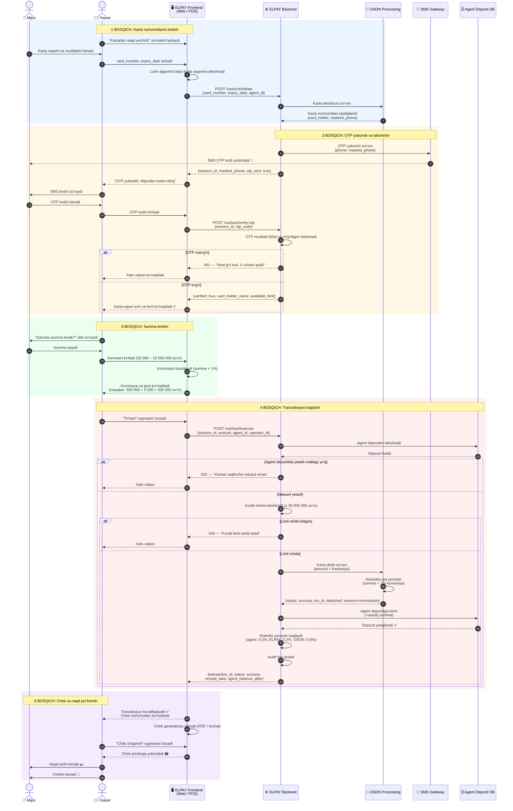
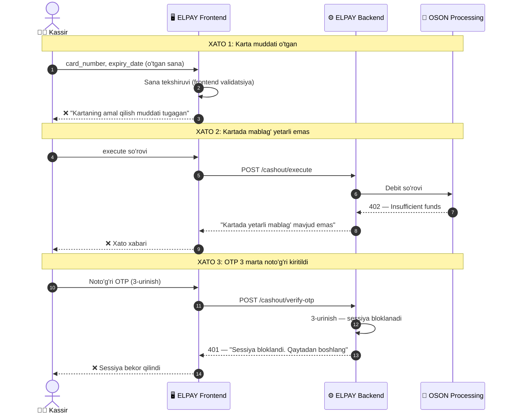
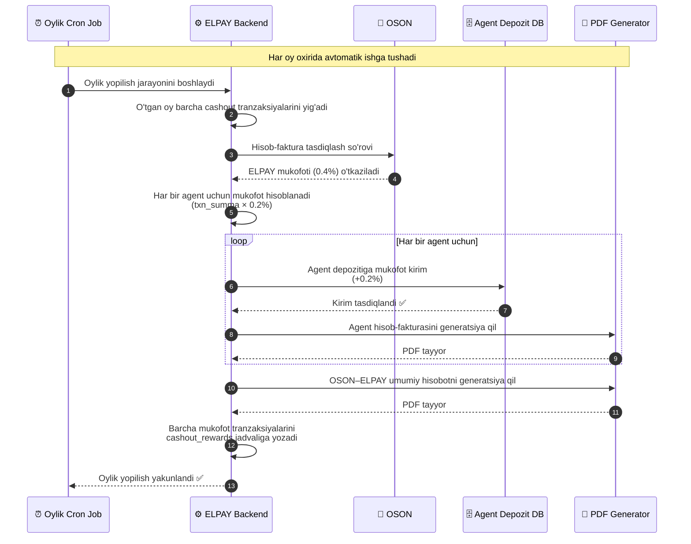

# Sequence Diagram — Kartadan Naqd Pul Yechish

## Ishtirokchilar:
- **Mijoz** — karta egasi
- **Kassir** — ELPAY agentining operatori
- **ELPAY Frontend** — Web yoki POS terminal
- **ELPAY Backend** — asosiy server
- **OSON Processing** — processing markazi
- **SMS Gateway** — OTP yuborish xizmati
- **Agent Depozit DB** — agent depoziti ma'lumotlar bazasi

---

## Asosiy Oqim (Happy Path)

---

## Xato Holatlari (Error Flows)

---

## Oylik Mukofot Oqimi (Month-End Flow)

---

## Ishtirokchilar va Ma'suliyat

| Ishtirokchi | Rol | Javobgar tomon |
|-------------|-----|----------------|
| 👤 Mijoz | Karta egasi, naqd oluvchi | — |
| 🧑‍💼 Kassir | ELPAY agenti operatori | Agent MCHJ/YaTT |
| 🖥️ ELPAY Frontend | Web / Android POS UI | Frontend dasturchi |
| ⚙️ ELPAY Backend | Biznes logika, API | Backend dasturchi |
| 🏦 OSON Processing | Karta processing, komissiya | OSON (3-tomon) |
| 📱 SMS Gateway | OTP yuborish | OSON integrator |
| 🗄️ Agent Depozit DB | Depozit holati | Backend dasturchi |
| ⏰ Cron Job | Oylik mukofot taqsimoti | Backend dasturchi |
