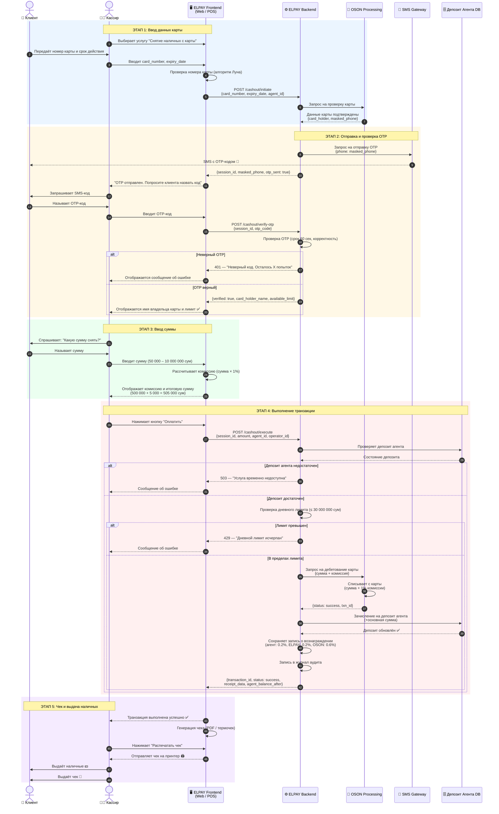
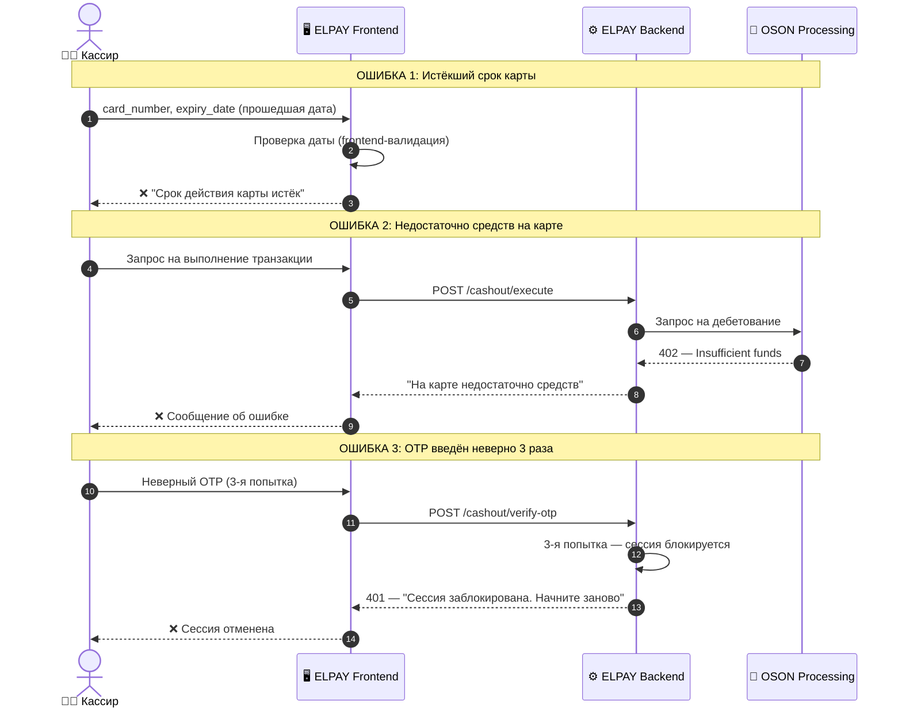
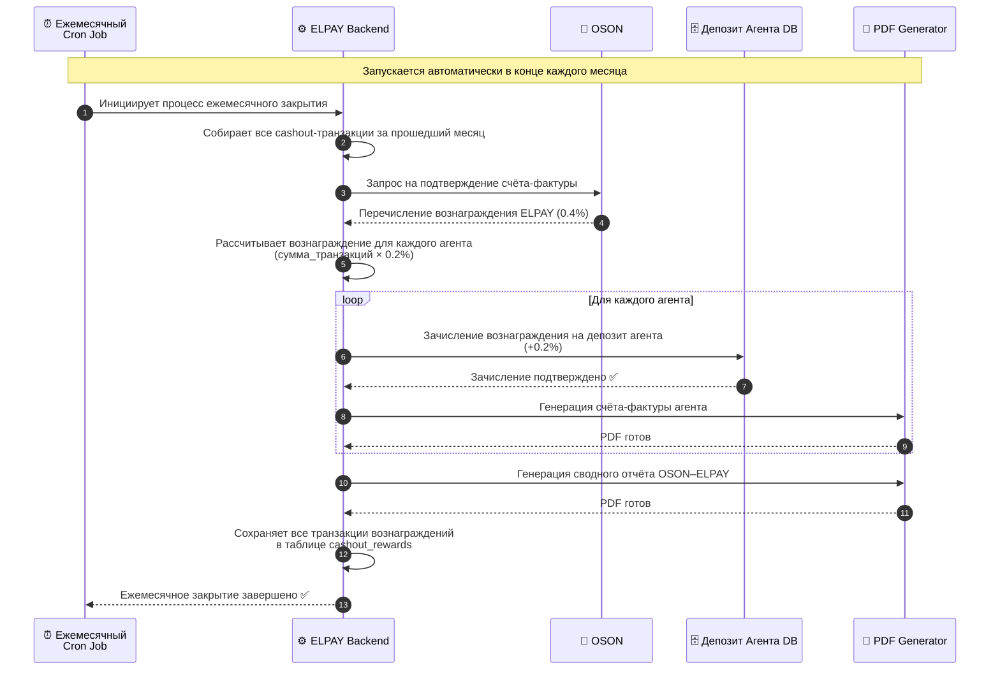

# Диаграмма последовательности — Снятие наличных с карты

## Участники:
- **Клиент** — владелец карты
- **Кассир** — оператор агента ELPAY
- **ELPAY Frontend** — Web или POS-терминал
- **ELPAY Backend** — основной сервер
- **OSON Processing** — процессинговый центр
- **SMS Gateway** — сервис отправки OTP
- **Agent Deposit DB** — база данных депозита агента

---

## Основной поток (Happy Path)

---

## Обработка ошибок (Error Flows)

---

## Ежемесячный поток вознаграждений (Month-End Flow)

---

## Участники и ответственность

| Участник | Роль | Ответственная сторона |
|----------|------|-----------------------|
| 👤 Клиент | Владелец карты, получатель наличных | — |
| 🧑‍💼 Кассир | Оператор агента ELPAY | Агент ООО/ИП |
| 🖥️ ELPAY Frontend | Web / Android POS UI | Frontend-разработчик |
| ⚙️ ELPAY Backend | Бизнес-логика, API | Backend-разработчик |
| 🏦 OSON Processing | Процессинг карт, комиссия | OSON (3-я сторона) |
| 📱 SMS Gateway | Отправка OTP | Интегратор OSON |
| 🗄️ Депозит Агента DB | Состояние депозита | Backend-разработчик |
| ⏰ Cron Job | Ежемесячное распределение вознаграждений | Backend-разработчик |
